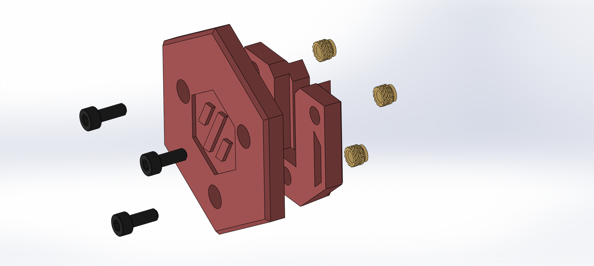
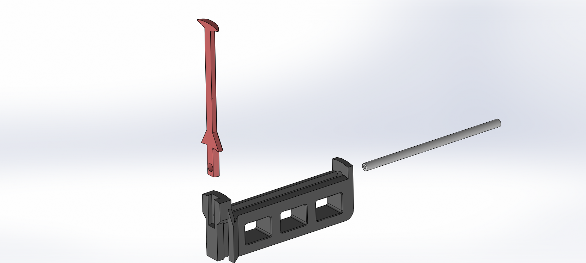
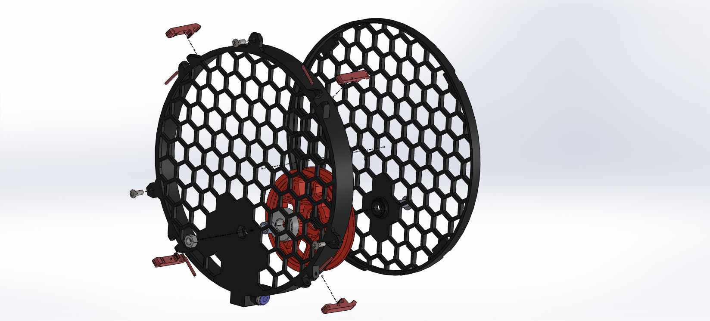
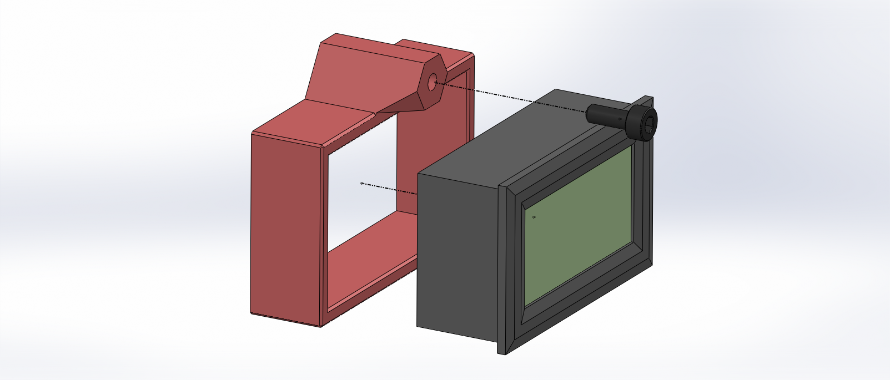
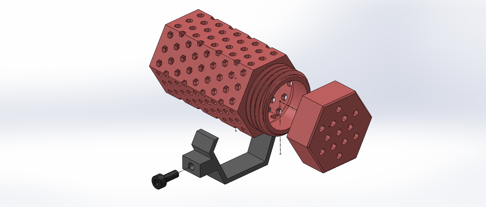

# 4L Buffer Spool - BETA

This buffer solution is still heavliy in beta, changes to the design will come out as issues and areas of improvement are identified.

## BOM

- 4L Air Tight Container
    - The one used for the initial design is [here](https://www.amazon.com/Containers-PRAKI-Airtight-Leak-proof-Canister/dp/B08TWH2QHV/ref=pd_rhf_ee_s_rp_c_2_4/142-3630995-6911105?pd_rd_w=NsqEw&pf_rd_p=5504b049-e102-4aa1-bed5-5cbcc3702210&pf_rd_r=V2H8ZEMQV48BSCNPQBP8&pd_rd_r=95199d46-c915-4553-b019-1fa26afedc4e&pd_rd_wg=uHuj3&pd_rd_i=B08TWH2QHV&psc=1). HOWEVER it was found that the KVP spools had clearance issues. With the help of discord members I am currently looking into alternative options.
- 6x (or 3x) M3x.05 heat set inserts
- 8x M3x8 BHCS
- 3x M3 hex nuts
- 3x M3x8 BHCS
- 1x M5x16 BHCS
- 1x M5 nylon lock nut
- Optional
    - Hydrometer
    - Silica

# Assembly

Spool hanger, filament passthru and buffer are mandatory, desiccant and hydrometer are optional

## Filament Passthru

Two variations; one using heat set inserts and the other forms threads in the plastic.

Assembly

1.  Measure approximately XXXXmm from the bottom of the container and mark the middle.
2.  Drill a 1/2" hole
3.  Insert the Filliment\_Passthru\_Interior.STL.
4.  Mark the three fastener holes
5.  Remove the Filliment\_Passthru\_Interior.STL and drill (hole size)
6.  Assemble

### Future Design Considerations

At this time there is no plan to modify this assembly

## Spool Hanger

Assembly

1.  Slide the Hanger\_Handle.STL into the slot on the Spool\_Arm.STL and install the PTFE tube to lock it into place

Mounting

1.  Measure approximately XXXXmm from the bottom of the container and mark the middle.
2.  Drill a 1/8" hole and hang the \[a\]\_Spool\_Arm_Exterior.STL using the bottom screw hole.
3.  Orient the \[a\]\_Spool\_Arm_Exterior.STL so that the edges are relatively square to the bottom of the container
4.  Mark the two remaining holes and drill.
5.  Mount the Assembly, sandwiching the container in between \[a\]\_Spool\_Arm\_Exterior.STL and \[a\]\_Spool\_Arm\_Catch.STL

### Future Design Considerations

## Filament Buffer

Assembly

1.  Install the \[a\]\_Buffer\_Latch\_x4.STLs around the perimeter of the Buffer\_Case.STL using a piece of filament as the hinge
2.  press the bearing insert into the bearing and then the bearing in the Buffer_Wheel.STL
3.  Install the bowden collet into the buffer case.stl

mounting

1.  Measure approximately XXXXmm from the bottom of the container and mark the middle.
2.  Drill a 1/8" hole and hang the Buffer_Case.STL by the top screw and mark the two remaining holes, then drill
3.  Before mounting with the final two screws install the Nylon lock nut in the recess in the buffer cover.

### Future Design Considerations

Clearances of current design, Possibility for future redesign to improve usability 

## Hydrometer (Optional)

A Simple hydrometer bracket that mounts using a single M3x8 SHCS, installed against the bottom interior surface to prevent it from rotating.

### Future Design Considerations

At this time there is no plan to modify this assembly

## Desiccant Pack (Optional)

Mounts in a similar fashion to the hydrometer bracket

### Future Design Considerations

At this time there is no plan to modify this assembly

# Tag Plate

Yet to be designed, will be a magnetic tag plate displaying channel number.
